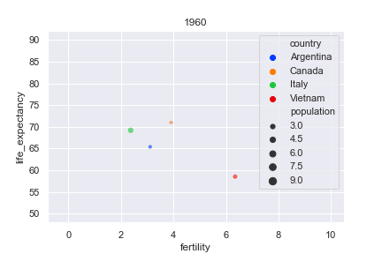
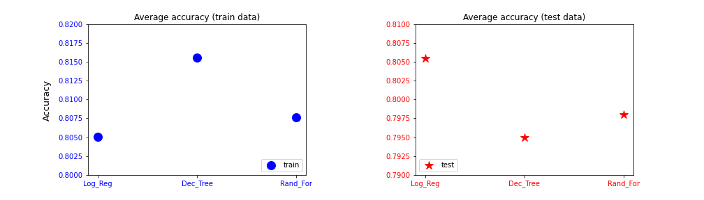
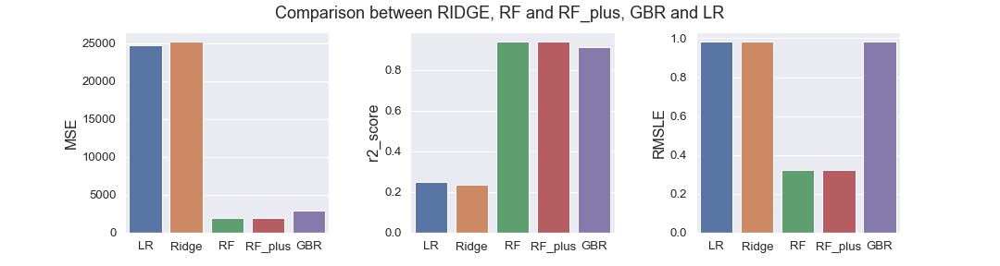
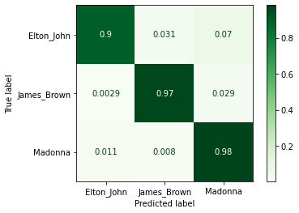

## Gapminder
 The project analyzes one of the [Gapminder](https://www.gapminder.org/) projects by [Hans Rosling](https://en.wikipedia.org/wiki/Hans_Rosling).

I selected few countries (Argentina, canada, Italy and Vietnam) and plotted the life expectation vs fertility rate in 50 years. The dimension of scattered point is proportional to the population.
The population legend must be multiplied by 10 millions.

* Life Expectancy vs. Fertility:
  

  
  

The Jupyter notebook about this project can be found [here](./Life_expectancy_Fertility/animated_scatteredplot.ipynb)

## Surviving Titanic
The project is a classification problem. The aim is to train and test different machine learning models to predict the surviving probability of passengers of the RMS Titanic, during the tragedy of 15 April 1912.

I trained the data with Logistic Regression, Decision Tree and Random Forest and made a comparison of the three models for training and test data: 

  
  

The Jupyter notebook about this project can be found [here](./Surviving_Titanic/project2_survivingTitanic.ipynb)

I took part of the Kaggle competition "Titanic - Machine Leraning from disaster" [see here](https://www.kaggle.com/c/titanic/submissions)

## Bike Rental
The project is a regression project. The goal is to predict the number of bikes rented in at any hour using ML regeression models. The features are timestamp and wheater information. Therefore it is a timeseries problem.

I trained the data using different regressors: Linear Regression, Linear Regression with Ridge regularization, Random Forest and Gradient Boosting Regressor. For Random Forest I made a second training
called RF_plus, where I added some additional features, just to see if I could improve the score.
I compared these models with the  most popular regression scores: MSE (Mean Square Error), RMSLE (Root Mean Square Logarithmic Error) and $R^2$ score (Coefficient of Determination):

  
  

The Jupyter notebook about this project can be found [here](./Bike_Rental/bike_sharing_project.ipynb)

I took part of a Kaggle competition titled "Bike Sharing Demand - Forecast of a city bikeshare system". The results can be found [here](https://www.kaggle.com/c/bike-sharing-demand/submissions)

## Text Classification
The aim of this project is to develop a machine learning that is able to recognize the author of a song by reading a snippet of the lyrics. The main steps to develop such ML are:  
    1. Scrape artist pages to find lyrics links (I chose: Elton John, James Brown, Madonna)  
    2. Extract lyrics from lyrics pages  
    3. Model the lyric's text (I used Bag of Words + Spacy)  
    4. Divide train data and verification data  
    5. Use train data in a pipeline containing vectorizer and classifier (I used:: 2 vectorizer: CountVectorizer and TfidfVectorizer  and 2 classifiers: LogisticRegeression and RandomForestClassifier)  

The confusion matrix on the validation data is:

  
  

The directory structure can be found [here](./Text_Classification/Text_Classification_README).  
 In [src_README](./Text_Classification/src/src_README) is explained the meaning of the .py files
in the src folder and the use of the ML for prediction.

## Dashboard
This project is the first Data Engineering project in the bootcamp. The aim is to deploy a Matabase dashboard showing graphics and statistics which are created using data extrapolated from a postgreSQL database. The main steps to achieve the target are:
    1. Create a local postgreSQL database in my machine
    2. Download the data in .csv format from a source (I chose the default [Northwind](https://github.com/pawlodkowski/northwind_data_clean) database)
    3. Create the SQL tables needed for the project and copy the data from Northwind tables to my local database
    4. Create an account in AWS and instantiate a RDS database
    5. Copy the local database tables into the remote AWS database
    6. Create an Elastic Computer Server using the EC2 facility of AWS and create a SSH connection to my local machine (for access)
    7. Install Metabase dashboard connection in my EC2 Server (now EC2 communicates with RDS for data source and with Metabase for data visualization)
    8. Access to Metabase and create some interesting graphic using the Northwind data
    9. Deploy Dashboard

The used dataset is about production, shipping, selling and delivery of food product to customers of a fictional company called Northwind Traders.

