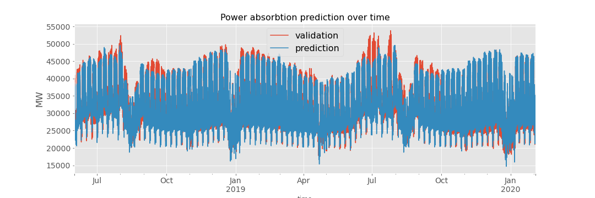

## Gapminder
 The project analyzes one of the [Gapminder](https://www.gapminder.org/) projects by [Hans Rosling](https://en.wikipedia.org/wiki/Hans_Rosling).

I selected few countries (Argentina, canada, Italy and Vietnam) and plotted the life expectation vs fertility rate in 50 years. The dimension of scattered point is proportional to the population.
The population legend must be multiplied by 10 millions.

* Life Expectancy vs. Fertility:
  

  
  

The Jupyter notebook about this project can be found [here](./Life_expectancy_Fertility/animated_scatteredplot.ipynb)

## Surviving Titanic
The project is a classification problem. The aim is to train and test different machine learning models to predict the surviving probability of passengers of the RMS Titanic, during the tragedy of 15 April 1912.

I trained the data with Logistic Regression, Decision Tree and Random Forest and made a comparison of the three models for training and test data: 

  
  

The Jupyter notebook about this project can be found [here](./Surviving_Titanic/project2_survivingTitanic.ipynb)

I took part of the Kaggle competition "Titanic - Machine Leraning from disaster" [see here](https://www.kaggle.com/c/titanic/submissions)

## Bike Rental
The project is a regression project. The goal is to predict the number of bikes rented in at any hour using ML regeression models. The features are timestamp and wheater information. Therefore it is a timeseries problem.

I trained the data using different regressors: Linear Regression, Linear Regression with Ridge regularization, Random Forest and Gradient Boosting Regressor. For Random Forest I made a second training
called RF_plus, where I added some additional features, just to see if I could improve the score.
I compared these models with the  most popular regression scores: MSE (Mean Square Error), RMSLE (Root Mean Square Logarithmic Error) and $R^2$ score (Coefficient of Determination):

  
  

The Jupyter notebook about this project can be found [here](./Bike_Rental/bike_sharing_project.ipynb)

I took part of a Kaggle competition titled "Bike Sharing Demand - Forecast of a city bikeshare system". The results can be found [here](https://www.kaggle.com/c/bike-sharing-demand/submissions)

## Text Classification
The aim of this project is to develop a machine learning that is able to recognize the author of a song by reading a snippet of the lyrics. The main steps to develop such ML are:  
    1. Scrape artist pages to find lyrics links (I chose: Elton John, James Brown, Madonna)  
    2. Extract lyrics from lyrics pages  
    3. Model the lyric's text (I used Bag of Words + Spacy)  
    4. Divide train data and verification data  
    5. Use train data in a pipeline containing vectorizer and classifier (I used:: 2 vectorizer: CountVectorizer and TfidfVectorizer  and 2 classifiers: LogisticRegeression and RandomForestClassifier)  

The confusion matrix on the validation data is:

  
  

The directory structure can be found [here](./Text_Classification/Text_Classification_README).  
 In [src_README](./Text_Classification/src/src_README) is explained the meaning of the .py files
in the src folder and the use of the ML for prediction.

## Dashboard
This project is the first Data Engineering project in the bootcamp. The aim is to deploy a Matabase dashboard showing graphics and statistics which are created using data extrapolated from a postgreSQL database. The main steps to achieve the target are:  
    1. Create a local postgreSQL database in my machine  
    2. Download the data in .csv format from a source (I chose the default [Northwind](https://github.com/pawlodkowski/northwind_data_clean) database)  
    3. Create the SQL tables needed for the project and copy the data from Northwind tables to my local database  
    4. Create an account in AWS and instantiate a RDS database  
    5. Copy the local database tables into the remote AWS database  
    6. Create an Elastic Computer Server using the EC2 facility of AWS and create a SSH connection to my local machine (for access)  
    7. Install Metabase dashboard connection in my EC2 Server (now EC2 communicates with RDS for data source and with Metabase for data visualization)  
    8. Access to Metabase and create some interesting graphic using the Northwind data  
    9. Deploy Dashboard  

The used dataset is about production, shipping, selling and delivery of food product to customers of a fictional company called Northwind Traders.

## ETL_pipeline
This is the second Data Engineering project. The goal is to setup a Docker pipeline to simulate the flow of information from the source to the final output. 
The following figure shows the workflow for this project:

  
  

The overall aim is to deploy tweets in a slackbot together with a score [-1,1] representing the feeling expressed by the tweet (-1 means "very negative feeling" and 1 means "super positive feeling").  
    1. Docker container "tweets_collector": the tweets are read from Twitter using Twitter API and the pytweets library  
    2. Docker container "mongo": The extracted tweets are uploaded in a mongoDB database  
    3. Docker container "etl":  
        &nbsp;&nbsp;&nbsp;&nbsp;Extract: each tweet is taken from mongoDB  
        &nbsp;&nbsp;&nbsp;&nbsp;Transform: each tweet is analysed using a [Vader Sentiment Analysis](https://github.com/cjhutto/vaderSentiment)  
        &nbsp;&nbsp;&nbsp;&nbsp;Load: load tweets, authors and sentiment score in a postgres DB  
    4. Docker container "postgres": psql DB is used to store tweets with sentiment score before to deply them in bot  
    5. Docker container "slackbot": In an automated fashion are are deployed in Slack the tweets with feeling score  
These steps are orchestrated by docker-compose that executes a docker-compose.yml file to concatenate all passages.  

The docker-compose.yml and the subfolder used by the ETL_pipeline project can be found [here](./ETL_pipeline/pipeline)

## Time series
In this project the goal is to predict a time series in the future given information in the past. I chose a kaggle time series concerning the power consumption in west countries in the last 5-6 years (dataset [here](https://www.kaggle.com/francoisraucent/western-europe-power-consumption)). Amongs all available countries I chose Italy, which is my home contry. The signal is a time series about electrical power abosorbtion (in Megawatts) in Italy from 2015 to 2020, given hour by hour. I took the following steps: 
1. Data analysis and data wrangling to discover time seasonalities and "hidden" information  
2. Divide data into training and verification sets  
3. Perform a feature engineering (OneHotEncoder, KBin, Polyfeature) adding an additional feature, i.e holidays  
4. Set a pipeline including feature engineering and regression model (I chose Ridge) and fit the model  
5. Check the results on validation data and calculate scores (smape, MAE)  ## Time series

The Ridge model can predict the power consumption on the validation data with a mean absolute error (MAE) of 1415 MW, corresponding to an percentage error (smape)of 4.3%. 

The Jupyter notebook of this project can be found [here](./Time_series/energy_consumption_Italy.ipynb)

## Markov Chain simulation
In this project I worked in team with two good mates. The aim is to simulate the shopping behaviour of the clients of an hypotetical food market using the Markov Chain Method. The starting points are .csv files where are recorded the past behaviours of customers:  
&ndash; &nbsp;&nbsp;The behaviour of the clients in the supuermarket is given for 5 days in the past (monday.csv to friday.csv)  
&ndash; &nbsp;&nbsp;The behaviour of a client consists in a sesquence of states. Each state is a food area in the supermarket  
&ndash; &nbsp;&nbsp;The states (i.e. food areas) are: "fruit", "spices", "drinks", "dairy", "checkout"  
&ndash; &nbsp;&nbsp;The customer can move freely from one state to another several times and can stay several minutes in the same state  
&ndash; &nbsp;&nbsp;When the customer arrives to the "checkout" state she finishes the shopping ("checkout" is an absorbing state).  
  
The final result is a graphical (and funny) representation of the market in style eighties where the clients move from one state to the other
doing shopping:

The file [README.md](./Markov_Chain/README.md) in the Markov_Chain folder explains in detail how to run the application. The codes can be found [here](./Markov_Chain/src/).

## Image recognition
The goal of this project is to develop a convolutional neural network (CNN) architecture able to recognize different objects. It is a classification problem in which we chose 7 different category objects: apple, knife, locher, orange, pencil, pumpkin, tomato. We made many pictures of each category, trying to change perspectives, object, environment in order to make the category not so easy to recognize (for an ANN). The pictures are saved in [data](./Image_recognition/data).  
I trained 4 different models and made a comparison. The models are:
1. Logistic regression model (easy, fast and powerful)  
2. Dense ANN (3 hidden layer of 256, 128, and 64 neurons respectivelly. Between layer I used a batchNormalization. As Activation I used LeakyReLu)  
3. CNN (Conv2D_64neurons -> MaxPool -> Conv2D_16neurons -> MaxPool -> Conv2D_32neurons -> MaxPool -> Flatten -> Dense_16neurons -> BatchNormalization -> LeakyReLu -Dense_7neurons(SoftMax))  
4. Keras mobilnet_v2 CNN + dense ([mobilenet_v2](https://keras.io/api/applications/mobilenet/#mobilenetv2-function) is a 14Mb CNN already trained and available at the Keras website (along many other and more complex CNN bases); the dense layer added to the mobilenet_v2 consists in a 16 neuron dense layer followed by a dropout and a dense final categorical layer (7 neurons with softmax activation))  

The following graphics show the performances of the 4 models:

 

The Jupyter notebook of this project can be found [here](./Image_recognition/object_classifier.ipynb)

